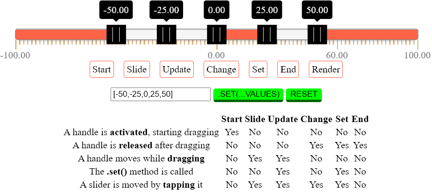
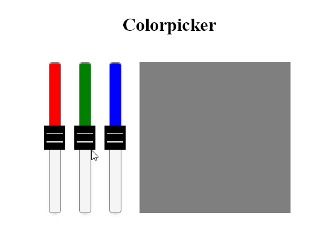
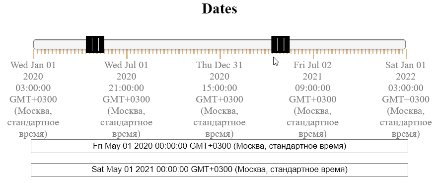
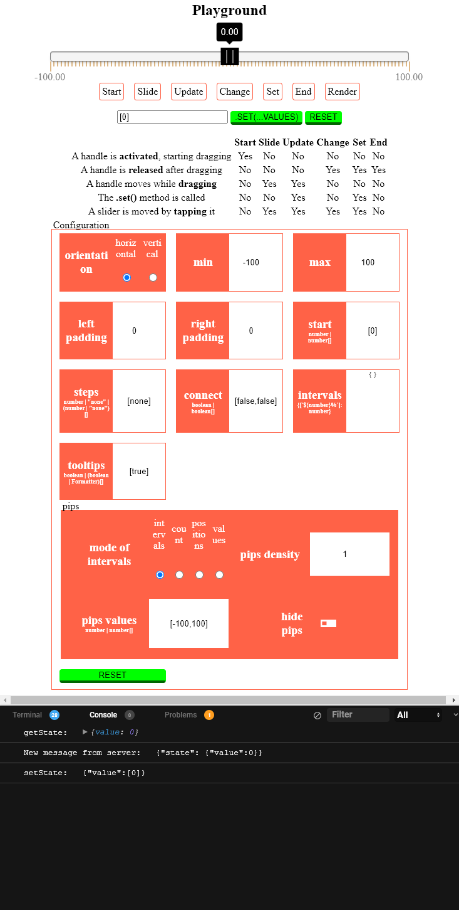
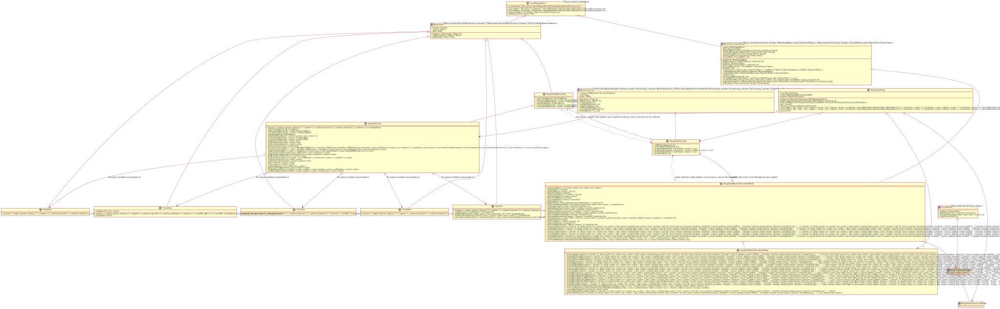

# MVP JQuery range slider



## Description

---

It's slider plugin using MVP pattern. It also contains script for connecting to JQuery.

## Demo

---





[The result is here](https://nzminusdev.github.io/jq-range-slider/).

## Usage

### Options

```ts
const RANGE_SLIDER_OPTIONS = {
  intervals?: { // min, max and intermediate values, default is { min: -100, max: 100 }
     [key: string]: number; // only "<number>%" key is accepted, number should be > 0 && < 100
        min: number;
        max: number;
  }
  start?: number | number[]; // start values of handles, default is [0]
  steps?: number | "none" | (number | "none")[]; // steps for each interval, default is [none]
  connect?: boolean | boolean[]; // bar between two handles or border of track, default is [false,false]
  orientation?: "horizontal" | "vertical"; // orientation of slider, default is "horizontal"
  padding?: number | [number, number]; // padding for value on track (actual value can't be more than intervals.max - padding[1] and less than intervals.min + padding[0]), default is [0,0]
  formatter?: (value: number) => string; // formatter for tooltips and pips, default is (value: number) => value.toFixed(2).toLocaleString()
  tooltips?: boolean | (boolean | (value: number) => string)[]; // presentation of tooltips, default is [true], P.S.: overrides formatter
  pips?: { // default is {mode: "intervals", values: [-100, 100], density: 1, isHidden: false}
     // "intervals" - values are displayed for each interval, pips.values doesn't matter
     // "count"     - pips.values assign amount of displayed values
     // "positions" - pips.values assign percentages
     // "values"    - pips.values assign track values
     mode?: "intervals" | "count" | "positions" | "values"; // default is "intervals"
     values?: number | number[];
     density?: number; // density of pips between values (amount of pips for each css %), default is 1
     isHidden?: boolean; // default is false
  }
};
const RANGE_SLIDER_MODEL = {
   eventSource: new EventSource('/stateChanger'),
  //to be executed on "set" event of slider
  async setState(state) {
    // example request
    await fetch("/fetch/post/state", {
      method: "POST",
      headers: {
        "Content-Type": "application/json;charset=utf-8",
      },
      body: JSON.stringify({ mode: "set", state: JSON.stringify(state) }),
    });

    return this;
  },
  //to be executed by init of view
  async getState() {
    // example request
    const response = await fetch("/fetch/post/state", {
      method: "POST",
      headers: {
        "Content-Type": "application/json;charset=utf-8",
      },
      body: JSON.stringify({ mode: "get" }),
    });

    const result = await response.json();

    return result;
  },
  // run callback(state) on each message from server
  whenStateIsChanged(callback) {
    this.eventSource.onmessage = function (event) {
      callback(JSON.parse(event.data).state);
    };
  },
  // close connections if new model is assigned
  closeConnections() {
    this.eventSource.onmessage = null;

    return this;
  },
};
```

### API (also you can just add [types](./app/dist/types/) folder if your editor supports d.ts files)

```ts
getOptions(): {
  intervals: { [key: string]: number; min: number; max: number; };
  start: number[];
  steps: (number | "none")[];
  connect: boolean[];
  orientation: "horizontal" | "vertical"
  padding: [number, number];
  formatter: (value: number) => string;
  tooltips: (boolean | Formatter)[];
  pips: {
    mode: "intervals" | "count" | "positions" | "values";
    values: number | number[];
    density: number;
    isHidden: boolean;
  }
};
getIntervalsOption(): { [key: string]: number; min: number; max: number; };
getStartOption(): number[];
getStepsOption(): (number | "none")[];
getConnectOption(): boolean[];
getOrientationOption(): "horizontal" | "vertical"
getPaddingOption(): [number, number];
getFormatterOption(): (value: number) => string;
getTooltipsOption(): (boolean | Formatter)[];
getPipsOption(): {
  mode: "intervals" | "count" | "positions" | "values";
  values: number | number[];
  density: number;
  isHidden: boolean;
}

// runs render, tip: call with empty object if you need just emit render
// to do reset pass undefined
setOptions(options?: {
  intervals: { [key: string]: number; min: number; max: number; }
  start: number | number[]
  steps: number | "none" | (number | "none")[]
  connect: boolean | boolean[]
  orientation: "horizontal" | "vertical"
  padding: number | [number, number]
  formatter: (value: number) => string
  tooltips: boolean | (boolean | Formatter
  pips: {
    mode: "intervals" | "count" | "positions" | "values";
    values: number | number[];
    density: number;
    isHidden: boolean;
  }
}): this;
// don't run render
// to do reset pass undefined
setIntervalsOption(intervals?: { [key: string]: number; min: number; max: number; }): this;
setStartOption(start?: number | number[]): this;
setStepsOption(steps?: number | "none" | (number | "none")[]): this;
setConnectOption(connect?: boolean | boolean[]): this;
setOrientationOption(orientation?: "horizontal" | "vertical"): this;
setPaddingOption(padding?: number | [number, number]): this;
setFormatterOption(formatter?: (value: number) => string): this;
setTooltipsOption(tooltips?: boolean | (boolean | Formatter)[]): this;
setPipsOption(pips?: {
  mode: "intervals" | "count" | "positions" | "values";
  values: number | number[];
  density: number;
  isHidden: boolean;
}): this;

get(): number[];
// to do reset pass undefined
set(value?: number | number[]): this;

on(eventName: "start" | "slide" | "update" | "change" | "set" | "end" | "render" | "remove", handler: ((..args: any) => void) | { handleEvent(...args: any): void; }): this;
off(eventName: "start" | "slide" | "update" | "change" | "set" | "end" | "render" | "remove", handler: (...args: any) => void): this;
trigger(eventName: "start" | "slide" | "update" | "change" | "set" | "end" | "render" | "remove", ...args: any): this;

remove(): this;
```

### Native js

Plug in:

```html
<link rel="stylesheet" href="range-slider.css" />
<script src="range-slider-plugin.js" defer="defer"></script>
```

Init:

```js
new window.RangeSliderPresenter(
  document.querySelector(".slider-container"),
  (reason) => { console.error(reason) }, // errorCatcher
  RANGE_SLIDER_OPTIONS, // it's optional
  RANGE_SLIDER_MODEL // it's optional
);
```

### JQuery

Plug in:

```html
<link rel="stylesheet" href="range-slider.css" />
<script
  src="https://code.jquery.com/jquery-3.6.0.min.js"
  integrity="sha256-/xUj+3OJU5yExlq6GSYGSHk7tPXikynS7ogEvDej/m4="
  crossorigin="anonymous"
  defer="defer"
></script>
<script src="range-slider-plugin.js" defer="defer"></script>
<script src="jq-range-slider-plugin.js" defer="defer"></script>
```

init:

```js
const sliders = $(".slider-container").initRangeSlider(
  (reason) => { console.error(reason) }, // errorCatcher
  RANGE_SLIDER_OPTIONS, // it's optional
  RANGE_SLIDER_MODEL // it's optional
);
```

## Contribution

---

### What do you need to start

1. Package manager [NPM](https://www.npmjs.com/) and [NodeJs](https://nodejs.org/en/) platform.
2. Some CLI to execute commands from directory of your project (bash is recommended).
3. Clean VS Code editor(optional).

### Installation

```bash
git clone https://github.com/NZMinusDev/jq-range-slider.git
cd jq-range-slider
npm i
```

### Managing

In [package.json](./package.json) you can find useful scripts for managing the project. To run script, use the following command:

```bash
npm run {script-name}
```

Script-names:

- **start** - builds bundles and runs servers: webpack-dev-server and server with express;
- **dev** - just builds bundles and place it into [dist](./app/dist) directory;
- **build** - build minify bundles and place it into [dist](./app/dist) directory + run _types_ script;
- **types** - generate d.ts files and place it into [dist/types](./app/dist/types) directory;
- **UML** - generate .puml files and place it into [src](./app/src/plugin/UML/) directory. P.S.: you should work [with your hands](https://plantuml.com/en/class-diagram) a little cause of the [tool](https://github.com/bafolts/tplant) has bugs(["default" isn't keyword](https://github.com/bafolts/tplant/issues/66), [error when output directory doesn't exist](https://github.com/bafolts/tplant/issues/51), [Missing Aggregation/Composition](https://github.com/bafolts/tplant/issues/48), etc);
- **test** - run jest tests(matches .spec. or .test. files), P.S.: it can work in a separate console in parallel with **start** script;
- **analyze** - visualize size of webpack output files with an interactive zoomable treemap using webpack-bundle-analyzer;
- **ext** - install necessary VS Code extensions.

### Technologies

1. [Shared VS Code settings](./.vscode/settings.json).
2. VS code extensions which increase comfort:
   1. [GitLens](https://marketplace.visualstudio.com/items?itemName=eamodio.gitlens).
   2. [PowerShell](https://marketplace.visualstudio.com/items?itemName=ms-vscode.PowerShell).
   3. [Ayu](https://marketplace.visualstudio.com/items?itemName=teabyii.ayu).
   4. [Material Icon Theme](https://marketplace.visualstudio.com/items?itemName=PKief.material-icon-theme).
   5. [CSS Peek](https://marketplace.visualstudio.com/items?itemName=pranaygp.vscode-css-peek).
   6. [HTML CSS Support](https://marketplace.visualstudio.com/items?itemName=ecmel.vscode-html-css).
   7. [Path Autocomplete](https://marketplace.visualstudio.com/items?itemName=ionutvmi.path-autocomplete).
   8. [Auto Complete Tag](https://marketplace.visualstudio.com/items?itemName=formulahendry.auto-complete-tag).
   9. [Change-Case](https://marketplace.visualstudio.com/items?itemName=wmaurer.change-case).
   10. [Bracket Pair Colorizer](https://marketplace.visualstudio.com/items?itemName=CoenraadS.bracket-pair-colorizer).
   11. [Code Spell Checker](https://marketplace.visualstudio.com/items?itemName=streetsidesoftware.code-spell-checker).
   12. [TODO Highlight](https://marketplace.visualstudio.com/items?itemName=wayou.vscode-todo-highlight).
   13. [Quokka.js](https://marketplace.visualstudio.com/items?itemName=WallabyJs.quokka-vscode).
   14. [ESLint](https://marketplace.visualstudio.com/items?itemName=dbaeumer.vscode-eslint).
   15. [lit-html](https://marketplace.visualstudio.com/items?itemName=bierner.lit-html).
   16. [Prettier - Code formatter](https://marketplace.visualstudio.com/items?itemName=esbenp.prettier-vscode).
   17. [Image preview](https://marketplace.visualstudio.com/items?itemName=kisstkondoros.vscode-gutter-preview).
   18. [VSCode Map Preview](https://marketplace.visualstudio.com/items?itemName=jumpinjackie.vscode-map-preview).
   19. [SVG](https://marketplace.visualstudio.com/items?itemName=jock.svg).
   20. [markdownlint](https://marketplace.visualstudio.com/items?itemName=DavidAnson.vscode-markdownlint).
   21. [PlantUML](https://marketplace.visualstudio.com/items?itemName=jebbs.plantuml).
   22. [Sort Lines by Selection](https://marketplace.visualstudio.com/items?itemName=earshinov.sort-lines-by-selection).
   23. [Live Server](https://marketplace.visualstudio.com/items?itemName=ritwickdey.LiveServer).
   24. [Import Cost](https://marketplace.visualstudio.com/items?itemName=wix.vscode-import-cost).
   25. [JavaScript (ES6) code snippets](https://marketplace.visualstudio.com/items?itemName=xabikos.JavaScriptSnippets).
   26. [Webpack Snippets](https://marketplace.visualstudio.com/items?itemName=gogocrow.webpack-snippets).
3. Preprocessors which speed up work:
   1. [Pug](https://pugjs.org/api/getting-started.html).
   2. [SCSS](https://sass-lang.com/).
   3. [TypeScript](https://www.typescriptlang.org/).
4. [Webpack](https://v4.webpack.js.org/concepts/) which kill your headaches:
   1. You can simply import files at the entry point([dev](./app/src/pages/index/index.ts) or [build](./app/src/plugin/range-slider-plugin.ts)) instead of manually connecting them using tags on the page.
   2. [Pages](./app/src/pages/) only need to be created, and the collector can determine the entry points on its own.
   3. No need to remember a bunch of css prefixes and what properties are supported thanks to [PostCSS Preset Env](https://github.com/csstools/postcss-preset-env) and [Autoprefixer](https://www.npmjs.com/package/autoprefixer).
   4. Output files is minified in production mode.
   5. There is no need to write relative paths for import when there are [excellent aliases](./configs/webpack.config.js) for the most popular paths in development.
   6. During development, when changing files, the result is immediately visible without manual reboots and builds.
   7. During the build, webpack will notify you if: there are circular dependencies, libraries of different versions are connected, there are unused files, there are css properties that browsers do not support. Displays the speed of source processing at each stage of the build.
   8. It should work the same on different platforms.
5. [ESLinter](https://eslint.org/) based on [Airbnb standarts](https://github.com/airbnb/javascript) integrated with prettier and typescript which protects your knee from :gun: and your life from wasting :clock2:.
6. [Jest](https://jestjs.io/): delightful JavaScript Testing Framework with a focus on simplicity, it works fine with TypeScript.
7. Pre-installed libraries:
   1. [JQuery](https://jquery.com/).
   2. [lodash-es](https://lodash.com/) to supplement the js standard. Tip: you should use only import of lodash-es(moreover, when importing, only care about the readability and strictness of the code, and not the optimization of the weight) instead of common lodash because ES6+ module syntax is supported by terser for optimization.
   3. [lit-html](https://lit-html.polymer-project.org/guide) to highlight html inside js/ts and only update the parts of the template that have changed since the last render.
8. Custom Tools: [ts shortcuts](./app/src/utils/devTools/).

### How it works



## License

This project is licensed under the terms of the [MIT license](LICENSE).
