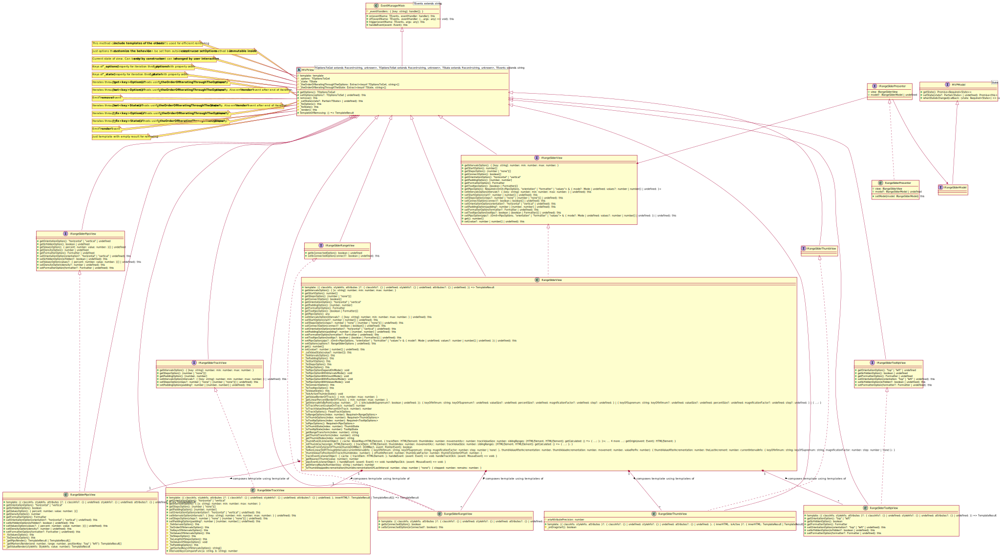

# MVP JQuery range slider


## Description

---

It's jq-range-slider plugin using MVP on typescript.

## Demo

---

### Colorpicker


## Playground

---

_https://codesandbox.io/s/mvp-jq-range-slider-x14h1?file=/src/server/index.js_

## Usage

### Options

```ts
const RANGE_SLIDER_OPTIONS = {
  intervals?: { // min, max and intermediate values, default is { min: -100, max: 100 }
     [key: string]: number; // only "<number>%" key is accepted, number should be > 0 && < 100
        min: number;
        max: number;
  }
  start?: number | number[]; // start values of handles, default is [0]
  steps?: number | "none" | (number | "none")[]; // steps for each interval, default is [none]
  connect?: boolean | boolean[]; // bar between two handles or border of track, default is [false,false]
  orientation?: "horizontal" | "vertical"; // orientation of slider, default is "horizontal"
  padding?: number | [number, number]; // padding for value on track (actual value can't be more than intervals.max - padding[1] and less than intervals.min + padding[0]), default is [0,0]
  formatter?: (value: number) => string; // formatter for tooltips and pips, default is (value: number) => value.toFixed(2).toLocaleString()
  tooltips?: boolean | (boolean | (value: number) => string)[]; // presentation of tooltips, default is [true], P.S.: overrides formatter
  pips?: { // default is {mode: "intervals", values: [-100, 100], density: 1, isHidden: false}
     // "intervals" - values are displayed for each interval, pips.values doesn't matter
     // "count"     - pips.values assign amount of displayed values
     // "positions" - pips.values assign percentages
     // "values"    - pips.values assign track values
     mode?: "intervals" | "count" | "positions" | "values"; // default is "intervals"
     values?: number | number[];
     density?: number; // density of pips between values (amount of pips for each css %), default is 1
     isHidden?: boolean; // default is false
  }
};
const RANGE_SLIDER_MODEL = {
  //to be executed on "set" event of slider
  async setState(state) {
    // example request
    await fetch("/fetch/post/state", {
      method: "POST",
      headers: {
        "Content-Type": "application/json;charset=utf-8",
      },
      body: JSON.stringify({ mode: "set", state: JSON.stringify(state) }),
    });

    return this;
  },
  //to be executed by init of view
  async getState() {
    // example request
    const response = await fetch("/fetch/post/state", {
      method: "POST",
      headers: {
        "Content-Type": "application/json;charset=utf-8",
      },
      body: JSON.stringify({ mode: "get" }),
    });

    return await response.json();
  },
  // run callback(state) on each message from server
  whenStateIsChanged(callback) {
    let eventSource = new EventSource("/stateChanger");
    eventSource.onmessage = function (event) {
      callback(JSON.parse(event.data).state);
    };
  },
};
```

### API (also you can just add [types](./app/dist/types/) folder if your editor supports d.ts files)

```ts
getOptions(): {
  intervals: { [key: string]: number; min: number; max: number; };
  start: number[];
  steps: (number | "none")[];
  connect: boolean[];
  orientation: "horizontal" | "vertical"
  padding: [number, number];
  formatter: (value: number) => string;
  tooltips: (boolean | Formatter)[];
  pips: {
    mode: "intervals" | "count" | "positions" | "values";
    values: number | number[];
    density: number;
    isHidden: boolean;
  }
};
getIntervalsOption(): { [key: string]: number; min: number; max: number; };
getStartOption(): number[];
getStepsOption(): (number | "none")[];
getConnectOption(): boolean[];
getOrientationOption(): "horizontal" | "vertical"
getPaddingOption(): [number, number];
getFormatterOption(): (value: number) => string;
getTooltipsOption(): (boolean | Formatter)[];
getPipsOption(): {
  mode: "intervals" | "count" | "positions" | "values";
  values: number | number[];
  density: number;
  isHidden: boolean;
}

// runs render, tip: call with empty object if you need just emit render
// to do reset pass nothing
setOptions(options?: {
  intervals: { [key: string]: number; min: number; max: number; }
  start: number | number[]
  steps: number | "none" | (number | "none")[]
  connect: boolean | boolean[]
  orientation: "horizontal" | "vertical"
  padding: number | [number, number]
  formatter: (value: number) => string
  tooltips: boolean | (boolean | Formatter
  pips: {
    mode: "intervals" | "count" | "positions" | "values";
    values: number | number[];
    density: number;
    isHidden: boolean;
  }
}): this;
// don't run render
// to do reset pass nothing
setIntervalsOption(intervals?: { [key: string]: number; min: number; max: number; }): this;
setStartOption(start?: number | number[]): this;
setStepsOption(steps?: number | "none" | (number | "none")[]): this;
setConnectOption(connect?: boolean | boolean[]): this;
setOrientationOption(orientation?: "horizontal" | "vertical"): this;
setPaddingOption(padding?: number | [number, number]): this;
setFormatterOption(formatter?: (value: number) => string): this;
setTooltipsOption(tooltips?: boolean | (boolean | Formatter)[]): this;
setPipsOption(pips?: {
  mode: "intervals" | "count" | "positions" | "values";
  values: number | number[];
  density: number;
  isHidden: boolean;
}): this;

get(): number[];
// to do reset pass nothing
set(value?: number | number[]): this;

on(eventName: "start" | "slide" | "update" | "change" | "set" | "end" | "render" | "remove", handler: ((..args: any) => void) | { handleEvent(...args: any): void; }): this;
off(eventName: "start" | "slide" | "update" | "change" | "set" | "end" | "render" | "remove", handler: (...args: any) => void): this;
trigger(eventName: "start" | "slide" | "update" | "change" | "set" | "end" | "render" | "remove", ...args: any): this;

remove(): this;
```

### Native js

Plug in:

```html
<link rel="stylesheet" href="range-slider.css" />
<script src="range-slider-plugin.js" defer="defer"></script>
```

Init:

```js
new window.RangeSliderPresenter(
  document.querySelector(".slider-container"),
  [RANGE_SLIDER_OPTIONS], // it's optional
  RANGE_SLIDER_MODEL // it's optional
);
```

### JQuery

Plug in:

```html
<link rel="stylesheet" href="range-slider.css" />
<script
  src="https://code.jquery.com/jquery-3.6.0.min.js"
  integrity="sha256-/xUj+3OJU5yExlq6GSYGSHk7tPXikynS7ogEvDej/m4="
  crossorigin="anonymous"
  defer="defer"
></script>
<script src="range-slider-plugin.js" defer="defer"></script>
<script src="jq-range-slider-plugin.js" defer="defer"></script>
```

init:

```js
const sliders = $(".slider-container").initRangeSlider(
  RANGE_SLIDER_OPTIONS, // it's optional
  RANGE_SLIDER_MODEL // it's optional
);
```

## Сontribution

---

### What do you need to start

1. Package manager [NPM](https://www.npmjs.com/) and [NodeJs](https://nodejs.org/en/) platform.
2. Some CLI to execute commands from directory of your project (bash is recommended).
3. Clean VS Code editor(optional).

### Installation

Just clone this repository and execute:

```bash
npm i
```

### Usage

In [package.json](./package.json) you can find useful scripts for managing the project. To do this, use the following command:

```bash
npm run {script-name}.
```

Script-names:

- **start** - builds bundles and runs server to be upgraded;
- **dev** - just builds bundles and place it into [dist](./app/dist) directory;
- **build** - build minify bundles and place it into [dist](./app/dist) directory + run _types_ script;
- **types** - generate d.ts files and place it into [dist/types](./app/dist/types) directory;
- **UML** - generate .puml files and place it into [src](./app/src/components/common.blocks/primitives/range-slider/) directory. P.S.: you should work [with your hands](https://plantuml.com/en/class-diagram) a little cause of the [tool](https://github.com/bafolts/tplant) has bugs(["default" isn't keyword](https://github.com/bafolts/tplant/issues/66)[error when output directory doesn't exist](https://github.com/bafolts/tplant/issues/51), [Missing Aggregation/Composition](https://github.com/bafolts/tplant/issues/48), etc);
- **test** - run jest tests(matches .spec. or .test. files), P.S.: it can work in a separate console in parallel with **start** script;
- **analyze** - visualize size of webpack output files with an interactive zoomable treemap using webpack-bundle-analyzer;
- **ext** - install necessary VS Code extensions.

### How it works



## License

This project is licensed under the terms of the [MIT license](LICENSE).
